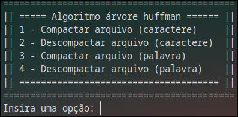

# Implementação de árvore de huffman para codificação e compressão de texto.

**Matéria:** Projeto e Análise de Algoritmos.

**Professor:** Rômulo Cesar Silva.

**Estudante:** [Marcos Sousa](https://github.com/molsousa).

## Descrição

Este repositório contém um algoritmo de codificação e compressão para a matéria de Projeto e Análise de Algoritmos.

## Implementação

- O código foi escrito em C++.

- A estrutura de dados principal utilizada foi árvore binária utilizando o algoritmo de huffman para a codificação.

- A complexidade do algoritmo é considerada ótima `O(n lg(n))`.

- É possível compactar textos por caractere ou por palavra.

## Como utilizar

### Carregar arquivo de texto

É possível carregar um arquivo de texto comum, sem uma sintaxe específica.

### Compilação e execução

É necessário compilar todos os arquivos fonte (`.cpp`) dentro da pasta do projeto, e ao gerar o executável, executar e utilizar o algoritmo.

Ao executar, um menu inicial é apresentado ao usuário com opções de utilizar e sair do menu. Após escolher a opção de utilizar, são apresentadas quatro opções, como demonstrado na captura de tela a seguir:

Após a compactação, é gerado um arquivo binário com tamanho comprimido que pode ser utilizado para descompressão no futuro, dentro do arquivo comprimido é criado um cabeçalho contendo principais informações para a descompressão.

Para mais informações relacionados a implementação, consultar os arquivos fontes e bibliotecas contidas na pasta raiz do projeto.

